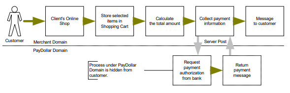

# Server Side Direct Connection

This connection method is for merchant to request payment authorization from bank directly through PayDollar PayGate system and subject to approval of acquiring bank. For example, merchant’s IVR system or mobile application can directly integrate to us. And in this connection, merchants need to build their own payment information collection page to collect payment information, such as credit card number, expire data, holder’s name and etc. Then, payment information has to be sent to a defined URL provided by the acquiring bank. Customer of the merchant, therefore, will not see any bank’s payment page.

<figure><figcaption></figcaption></figure>

For merchant who chooses this method of connection, 128-bit SSL cert must be installed for data encryption. The system does not accept non-encrypted data.&#x20;

PayDollar uses Extended Validation (EV) SSL Certificate. To ensure your system function properly, please check your certificate store can recognize VeriSign intermediate CA certificate - Secure Site Pro/Managed PKI for SSL Premium with EV Certificates. If not, you are required to install the VeriSign intermediate CA certificate in your certificate store.&#x20;

Please download the primary and secondary VeriSign EV SSL Intermediate CA certificates from the following link then import the 2 certificates into the keystore of your environment.&#x20;

http://www.verisign.com/support/verisign-intermediate-ca/extended-validation-pro/index.html&#x20;

(Please be reminded that you should choose the option “Issued After May 17th, 2009”)&#x20;

We use Server Side Direct Connection for App 2 App integration and wallet payment direct integration. For the detail, please reference with "<mark style="color:orange;">**Integration Guide (Wallet Direct Connection)**</mark>”
